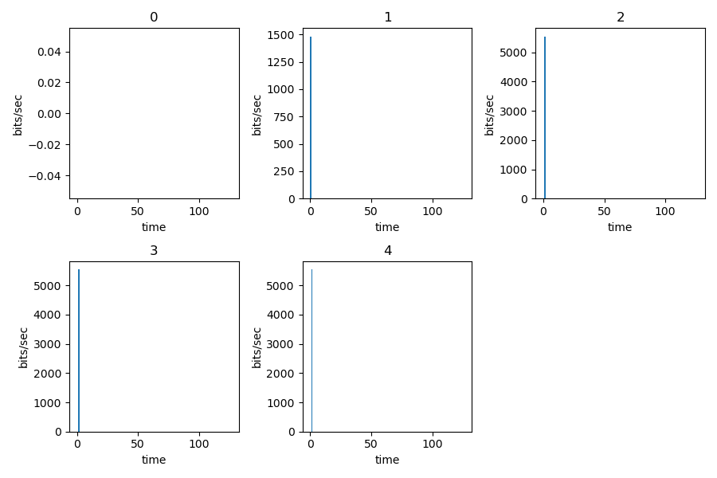
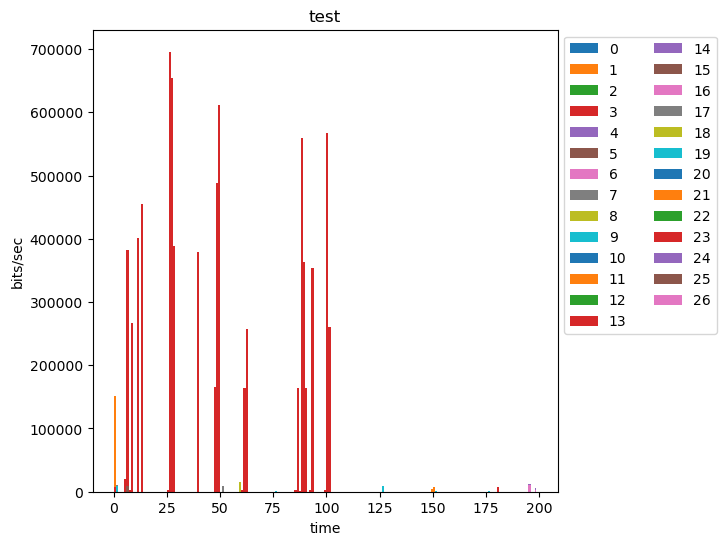

# promprog_project

Project for industrial programming course

## classification

Classifiers and data preparation

Required packages: pandas, scikit-learn

```
usage:  
python3 data_praparation.py  
python3 classifier.py
```

Work examples:

```
Starting data preparation
Data saved to data.csv

KNN best result:
n = 5
accuracy = 0.71

SVC best result:
kernel = linear
accuracy = 0.71

CatBoost best result:
iterations = 200, cv = 10, learning_rate = 0.05
accuracy = 0.75

Best classifier is CatBoost with accuracy = 0.75

Result is saved in result.txt
```


## plots

PACP streams visualising tool

Required packages: tshark, matplotlib

```
usage: python3 plotter.py [-h] path [protocol] [mode] [streams] [time_unit]

Build graphs for network streams

positional arguments:
  path        Path to pcap file or directory with pcap files
  protocol    Protocol in interest: TCP, QUIC, UDP or "any"
  mode        Graph type: grid or united plot
  streams     Streams to be plotted, space-separated
  time_unit   Time unit on the plot

optional arguments:
  -h, --help  show this help message and exit
```

Work examples:




